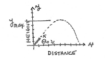

# MATH 176, Problem 6, Spring 87

**BACKGROUND**: According to a certain CALCULUS TEXT (Zill, pg 229), the height
                y of a given projectile launched with initial velocity V₀ at
                an angle θ₀ is given by the equation:

```
                      ┌       g        ┐
   y = x tan(θ₀) - x² │ ────────────── │
                      │ 2 V₀² cos²(θ₀) │
                      └                ┘
```

Where x is the horizontal distance from the point of launch and g is the
acceleration due to gravity. This text claims the maximum height attained
by the projectile is:

```
           V₀²  ┌          ┐
   y    = ───── │ sin²(θ₀) │
    max    2g   └          ┘
```

**PROGRAM**: Write a computer program that will accept as input the values of
V₀, θ₀, g and then search for the maximum height experimentally by starting
at x equal to zero, incrementing x by 0.1 until the height becomes negative.
The program should also compute the maximum height from the second formula
and then find the percent error (compared to the formula).

**INPUT**: V₀, θ₀, g (use at least five input sets of data)

**OUTPUT**: For each data set... list the initial conditions of V₀, θ₀, g
                                 state the max height experimentally
                                 state the max height calculated
                                 state the percent error.

**HAND IN**: FTNLIST of the program, output listing, hand calculation to
             verify the program operates correctly with sample data.

**QUESTION**: How could the percent error be reduced? Run an extra data set
              to verify your answer.

**NOTES**:

```
                π
   rad = deg * ───
               180
   
   π = 4 atan(1)
```


